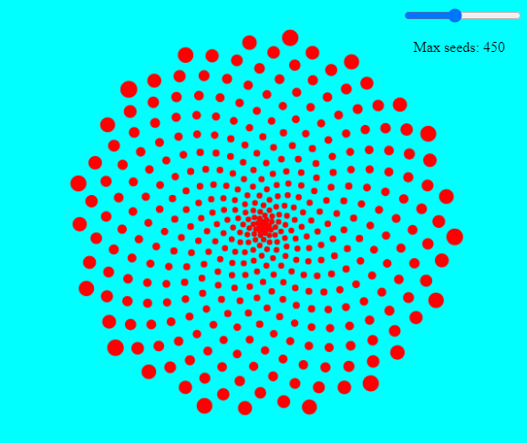

# Sunflower-seed-arrangement
Playing with distributions of dots

Entry point -> index.html

No webserver needed

Inspired from [this discussion](http://www.maths.surrey.ac.uk/hosted-sites/R.Knott/Fibonacci/fibnat2.html)